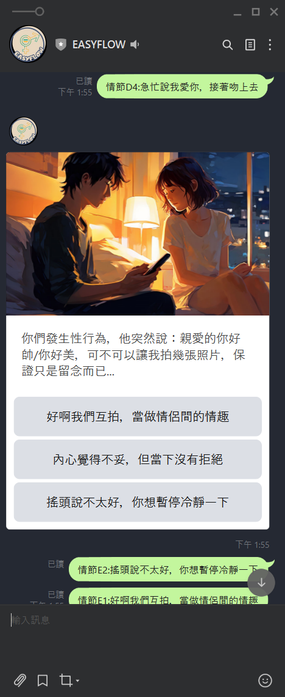
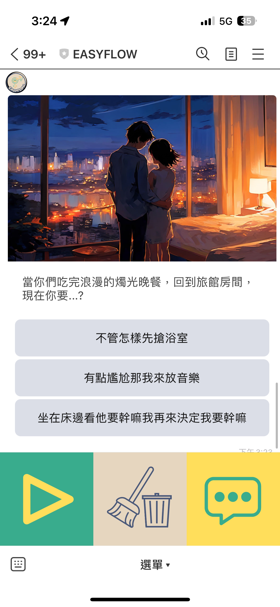
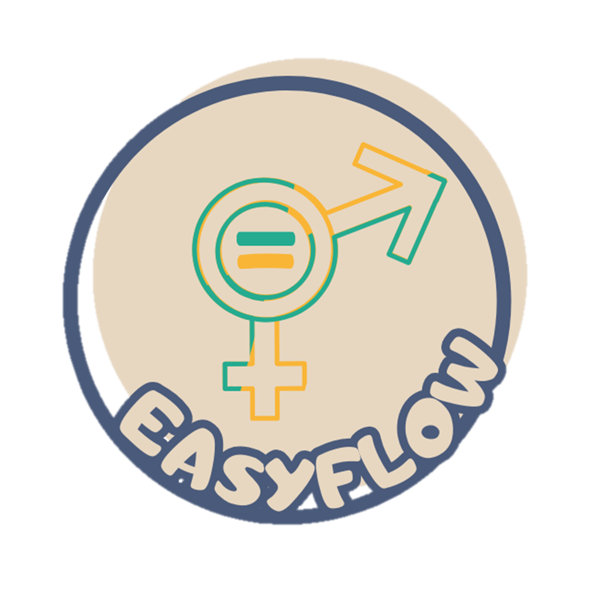

# EASYFLOW

SITCON Hackathon 2024 成果發表

## 競賽議題 & 子議題
- 團隊名稱：莫強求有什麼不隊
- 成員姓名：吳家驊、吳昱蓁、邱嘉敏、王柏崴
- 競賽議題：平等起跑線：用科技打破歧視的根源
    - 子議題：推廣性別平等與情感教育 X LINE

### 專案簡介
- 用途/功能：使用者可透過與LINE BOT互動式故事獲得不同的結局。

- 目標客群&使用情境：
    - 對於男女情感有疑惑的民眾:可透過此互動式故事，更理解情感議題。

- 操作方式：
    - 環境設置
        1. 可以看到 .env 檔案新增了兩個 API，
            * GEMINI_API 
            此為必需新增的 API，否則無法正常產出結局。
            * FIREBASE_API 
            此為儲存使用者對話的即時資料庫API，若無則無法正常產生摘要。
        2. 建立LINE CHANNEL，並且設置API
        3. 部屬上GCP
    - 使用者操作方式 
        1. 掃描QRCODE，即可透過RICH MENU開始體驗。

### 使用資源
- 企業資源：
    - gemini-pro 
    我們所選用的模型。
    - Firebase 
    儲存使用者選擇選項的即時資料庫。
    - Playground AI  
    產生劇本圖。

### 你還想分享的事情
- 開發過程&遇到的困難
  - 劇本好難想、圖片好難生、組員兩個確診
  - 還要做簡報QQ
  - GITHUB COMMENT都在亂寫
  - 想了一堆CICD，最後測試環境直接上

### 成果展示

LINEBOT ID:@747bxvem

成品圖

LOGO圖

### Q&A紀錄

(實際對答有點烙賽，只記錄意思...)

Q:劇本怎麼產的? 

A:劇本是事先寫好的，結局是GEMINI API 產生的。

Q:這次是歧視議題，請問這劇本有何關聯?

A:我們希望透過增進使用者對情感關係的理解，來消除歧視問題。

Q:有沒有什麼同性相關的題目?

A:這次時間緊湊，來不及做。

Q:故事走向是固定的嗎?

A:只有結局是生成的

Q:結局都差不多的話是不是不太需要AI?

A:我們實測同樣的選擇，AI會生成南轅北轍的結局，模擬真實世界複雜多變的情感關係。
